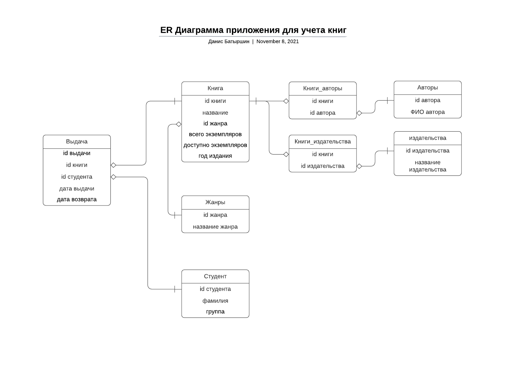
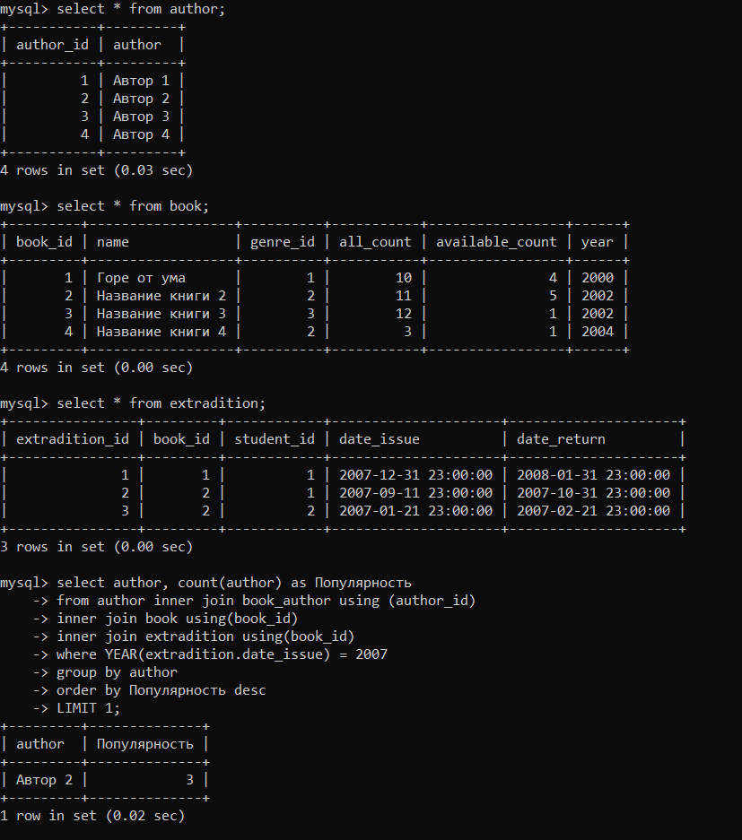

# FIS_test_task
## Задание 1
Начал я с сущности книги, id книги(первичный ключ), как и все другие id имеют тип int. По скриншоту в ТЗ было видно, что у одной книги было несколько авторов, предполагаю, что у одного автора есть несколько книг, соответственно, связь между книгами и авторами один ко многим(см. рис.). Аналогичная ситуация с книгами и издательствами. Книги могут сортироваться по жанрам(со скриншота в ТЗ), и предполагаю, что у одной книги один жанр, но у одного жанра несколько книг, связь один ко многоим, создаю сущность для жанров.
Далее создал сущность студентов, и сущность выдачи книг, в ней два внешних ключа - один относится к книге, второй к студенту, который её взял, у неё есть два поля с форматом datetime: дата, когда студент взял книгу, и дата, когда вернул.

## Задание 2
Как я понял, популярность автора определяется тем, сколько раз взяли его книги. Я причислял автора к определенному году, если в момент выдачи был этот год.
Решение в файле (https://github.com/Danis2019/FIS_test_task/blob/master/Numb2.sql)
### Для себя я реализовал базу данных в mysql, частично можно увидеть на следующем скриншоте

## Задание 3
